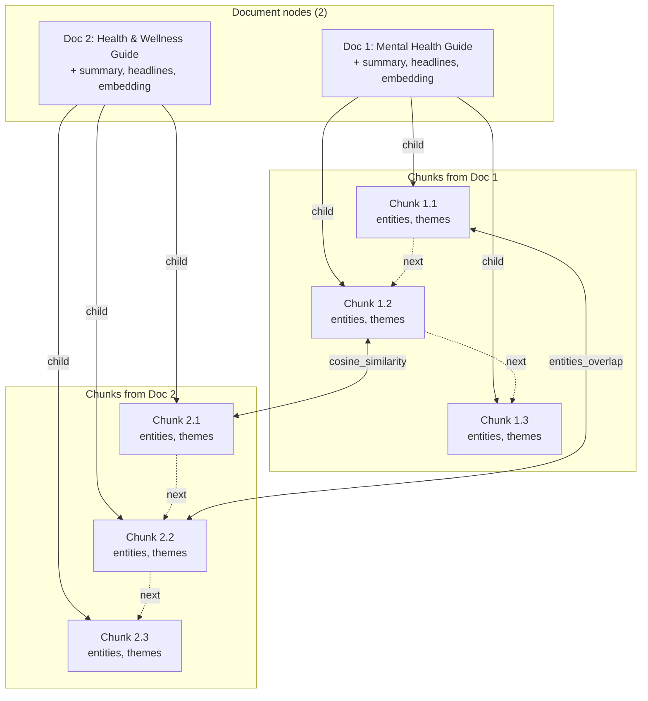

# Knowledge Graph — High-Level View

**Legend**
- **Document nodes**: Full `page_content` plus `headlines`, `summary`, `summary_embedding`.
- **Chunk nodes**: Section-level `page_content` plus `entities` and `themes`.
- **child**: Document → chunk (ownership).
- **next**: Chunk → chunk (order within a document).
- **cosine_similarity** / **entities_overlap**: Chunk ↔ chunk (similarity/overlap; can be across documents).

You can paste the Mermaid block into [Mermaid Live](https://mermaid.live) or any Markdown viewer that supports Mermaid to render the diagram.
